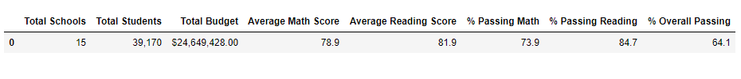
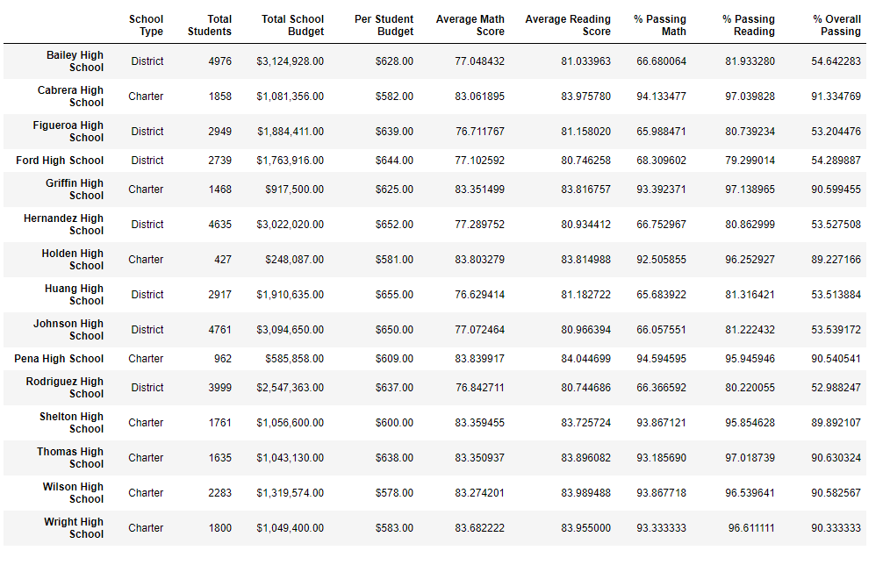
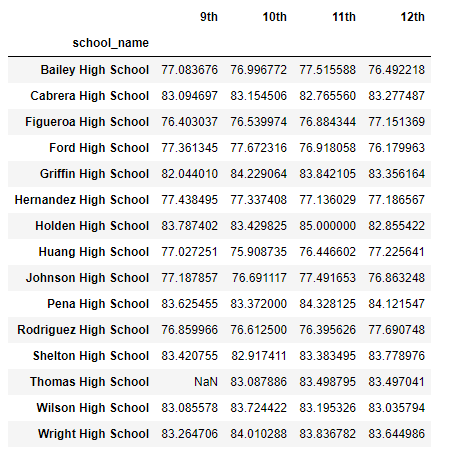
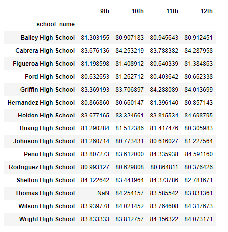
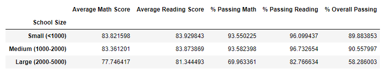

#**Overview of the school district analysis**
To view overall grades, budget, school size, school type and compare.

#**Results**
We were able to determine there were a total of 15 schools, over 39,000 students with a budget of over $24million between them in the district. 
We saw the average math score for the district was 78.9, average reading score was 81.9. Based on the scores of 70 and over as passing, about 73.9% of the district passed math, and 84.7 % passed reading; a total of 64.1% passed overall math and reading.

Based on the school summary dataframe, we can clearly see that charter schools have a much higher overall passing percentage compared to the district type schools.
We can also see that the populations of the charter schools are lower than thr district schools. 

There is a bulleted list that addresses how each of the seven school district metrics was affected by the changes in the data.
- The top five performing schools were all charter schools with 91.33% of the overall students passing, and the lowest of the top five still had 90.54% overall passing
- The bottom five performing schools were all district schools with only 53.54% passing.
- By checking the average math and reading scores per grade for each school, we can see that it is not much difference in the scores per grade in each school. The individual school seems to have around the same score per grade. 

- From seeing the average spending per student, we can see that the lower spending range per student yielded higher math and reading scores and a higher passing percentage. While the scores and percentage of students passing were lower, the higher the spending range per student was.

- From the viewing the scores based on school size, we saw that the schools with lower than 2000 students have much higher average test scores and a greater overall passing.

-Lastly, we can reconfirm based on school type, charter school students performed better than district school students
![Scores by School Type]{school_type.png)

#**Summary**
There is a statement summarizing four major changes to the school district analysis after reading and math scores have been replaced.
By removing 9th graders' test scores from Thomas High School, the percentage of students passing math jumped from 66.91% to 93.19% and the percentage of students passing reading went from 69.66% to 97.02%.
This raised the overall passing percentage for Thomas High School. 
By removing the scores of over 400 students, we skewed the results and scores of Thomas High School to a more favorable outlook.
Lastly, this may have moved Thomas High School into one of the top performing schools in the district.
